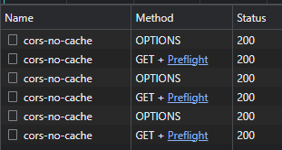
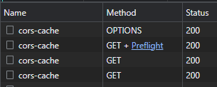

# CORS

[![Build Status][github-actions-shield]][github-actions]

Hosted at <https://salmon-pond-0870a1e00.2.azurestaticapps.net/>.

Illustrates different scenarios related to [CORS][cors]:

- A preflight request with the server responding without any `CORS` headers
- A preflight request with the server responding with all the expected `CORS` headers with the exception of `Access-Control-Max-Age`
- Preflight requests with the server responding with all the expected `CORS` headers including `Access-Control-Max-Age`
  - Use a different path and query string to demonstrate the impact on the cache

:rotating_light: ensure that _Disable cache_ is unchecked in the Network Developer Tools, otherwise the preflight requests will not be cached.

## Without any CORS headers

### Preflight request for NoCors

- URL: `https://cors-func.azurewebsites.net/no-cors`
- Method: `OPTIONS`

**Relevant preflight request headers**:

```text
access-control-request-headers: authorization
access-control-request-method: GET
origin: https://salmon-pond-0870a1e00.2.azurestaticapps.net
```

**Relevant preflight response headers**:

None

### Preflight result for NoCors

The preflight fails as the response does not contain a `Access-Control-Allow-Origin` header. See the output of the `Chrome` console below:

```text
Access to XMLHttpRequest at 'https://cors-func.azurewebsites.net/no-cors' from origin 'https://salmon-pond-0870a1e00.2.azurestaticapps.net' has been blocked by CORS policy: Response to preflight request doesn't pass access control check: No 'Access-Control-Allow-Origin' header is present on the requested resource.
```

## With CORS headers (but without Access-Control-Max-Age)

### Preflight request for CorsNoCache

- URL: `https://cors-func.azurewebsites.net/cors-no-cache`
- Method: `OPTIONS`

**Relevant preflight request headers**:

```text
access-control-request-headers: authorization
access-control-request-method: GET
origin: https://salmon-pond-0870a1e00.2.azurestaticapps.net
```

**Relevant preflight response headers**:

```text
access-control-allow-credentials: true
access-control-allow-headers: authorization
access-control-allow-method: GET
access-control-allow-origin: https://salmon-pond-0870a1e00.2.azurestaticapps.net
```

### Preflight result for CorsNoCache

The preflight succeeds and `Chrome` then issue the `GET` request.

### GET request for CorsNoCache

- URL: `https://cors-func.azurewebsites.net/cors-no-cache`
- Method: `GET`

**Relevant GET request headers**:

```text
authorization: Bearer TopSecret
origin: https://salmon-pond-0870a1e00.2.azurestaticapps.net
```

**Relevant GET response headers**:

```text
access-control-allow-origin: https://salmon-pond-0870a1e00.2.azurestaticapps.net
```

### GET result for CorsNoCache

The `GET` succeeds and returns the content of the `Authorization` header (super secure I know):

```json
{"authorization":"Bearer TopSecret"}
```

**Note**: each subsequent `GET` call requires a preflight request:



## With CORS headers (and with Access-Control-Max-Age)

### Preflight request for CorsCache

- URL: `https://cors-func.azurewebsites.net/cors-cache`
- Method: `OPTIONS`

**Relevant preflight request headers**:

```text
access-control-request-headers: authorization
access-control-request-method: GET
origin: https://salmon-pond-0870a1e00.2.azurestaticapps.net
```

**Relevant preflight response headers**:

```text
access-control-allow-credentials: true
access-control-allow-headers: authorization
access-control-allow-method: GET
access-control-allow-origin: https://salmon-pond-0870a1e00.2.azurestaticapps.net
access-control-max-age: 600
```

### Preflight result for CorsCache

The preflight succeeds and `Chrome` then issue the `GET` request.

### GET request for CorsCache

- URL: `https://cors-func.azurewebsites.net/cors-cache`
- Method: `GET`

**Relevant GET request headers**:

```text
authorization: Bearer TopSecret
origin: https://salmon-pond-0870a1e00.2.azurestaticapps.net
```

**Relevant GET response headers**:

```text
access-control-allow-origin: https://salmon-pond-0870a1e00.2.azurestaticapps.net
```

### GET result for CorsCache

The `GET` succeeds and returns the content of the `Authorization` header (super secure I know):

```json
{"authorization":"Bearer TopSecret"}
```

**Note**: subsequent `GET` calls do not issue preflight requests:



This is true as long as the result of the initial preflight is cached. `Access-Control-Max-Age` is capped by a [maximum value for each browser][max-age]:

- 24 hours for Firefox
- 2 hours for Chromium (10 minutes for v75 and prior)

The initial preflight is only cached for the same path and query string.

[cors]: https://developer.mozilla.org/en-US/docs/Web/HTTP/CORS
[max-age]: https://developer.mozilla.org/en-US/docs/Web/HTTP/Headers/Access-Control-Max-Age#Directives
[github-actions-shield]: https://github.com/gabrielweyer/cors/actions/workflows/workflow.yml/badge.svg
[github-actions]: https://github.com/gabrielweyer/cors/actions/workflows/workflow.yml
