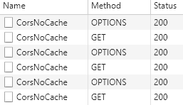

# CORS

Hosted at [https://corscache.blob.core.windows.net/index.html][cors-app].

Illustrates three scenarios related to [CORS][cors]:

- A preflight request with the server responding without any `CORS` headers
- A preflight request with the server responding with all the expected `CORS` headers with the exception of `Access-Control-Max-Age`
- A preflight request with the server responding with all the expected `CORS` headers including `Access-Control-Max-Age`

## Without any `CORS` headers

### Preflight request

- URL: `https://ik8zfy1go7.execute-api.ap-southeast-2.amazonaws.com/sob/NoCors`
- Method: `OPTIONS`

**Relevant preflight request headers**:

```text
access-control-request-headers: authorization
access-control-request-method: GET
origin: https://corscache.blob.core.windows.net
```

**Relevant preflight response headers**:

None

### Preflight result

The preflight fails as the response does not contain a `Access-Control-Allow-Origin` header. See the output of the `Chrome` console below:

```text
Failed to load https://ik8zfy1go7.execute-api.ap-southeast-2.amazonaws.com/sob/NoCors: Response to preflight request doesn't pass access control check: No 'Access-Control-Allow-Origin' header is present on the requested resource. Origin 'https://corscache.blob.core.windows.net' is therefore not allowed access.
```

## With `CORS` headers (but **without** `Access-Control-Max-Age`)

### Preflight request

- URL: `https://ik8zfy1go7.execute-api.ap-southeast-2.amazonaws.com/sob/CorsNoCache`
- Method: `OPTIONS`

**Relevant preflight request headers**:

```text
access-control-request-headers: authorization
access-control-request-method: GET
origin: https://corscache.blob.core.windows.net
```

**Relevant preflight response headers**:

```text
access-control-allow-credentials: true
access-control-allow-headers: authorization
access-control-allow-method: GET
access-control-allow-origin: https://corscache.blob.core.windows.net
```

### Preflight result

The preflight succeeds and `Chrome` then issue the `GET` request.

### GET request

- URL: `https://ik8zfy1go7.execute-api.ap-southeast-2.amazonaws.com/sob/CorsNoCache`
- Method: `GET`

**Relevant GET request headers**:

```text
authorization: Bearer sob
origin: https://corscache.blob.core.windows.net
```

**Relevant GET response headers**:

```text
access-control-allow-origin: https://corscache.blob.core.windows.net
```

### GET result

The `GET` succeeds and returns the content of the `Authorization` header (super secure I know):

```json
{"authorization":"Bearer sob"}
```

**Note**: each subsequent `GET` call requires a preflight request:



## With `CORS` headers (and **with** `Access-Control-Max-Age`)

### Preflight request

- URL: `https://ik8zfy1go7.execute-api.ap-southeast-2.amazonaws.com/sob/CorsCache`
- Method: `OPTIONS`

**Relevant preflight request headers**:

```text
access-control-request-headers: authorization
access-control-request-method: GET
origin: https://corscache.blob.core.windows.net
```

**Relevant preflight response headers**:

```text
access-control-allow-credentials: true
access-control-allow-headers: authorization
access-control-allow-method: GET
access-control-allow-origin: https://corscache.blob.core.windows.net
access-control-max-age: 86400
```

### Preflight result

The preflight succeeds and `Chrome` then issue the `GET` request.

### GET request

- URL: `https://ik8zfy1go7.execute-api.ap-southeast-2.amazonaws.com/sob/CorsCache`
- Method: `GET`

**Relevant GET request headers**:

```text
authorization: Bearer sob
origin: https://corscache.blob.core.windows.net
```

**Relevant GET response headers**:

```text
access-control-allow-origin: https://corscache.blob.core.windows.net
```

### GET result

The `GET` succeeds and returns the content of the `Authorization` header (super secure I know):

```json
{"authorization":"Bearer sob"}
```

**Note**: subsequent `GET` calls do not issue preflight requests:


This is true as long as the result of the initial preflight is cached. `Access-Control-Max-Age` is capped by a [maximum value for each browser][max-age]:

- 24 hours for Firefox
- 10 minutes for Chromium

[cors-app]: https://corscache.blob.core.windows.net/index.html
[cors]: https://developer.mozilla.org/en-US/docs/Web/HTTP/CORS
[max-age]: https://developer.mozilla.org/en-US/docs/Web/HTTP/Headers/Access-Control-Max-Age
